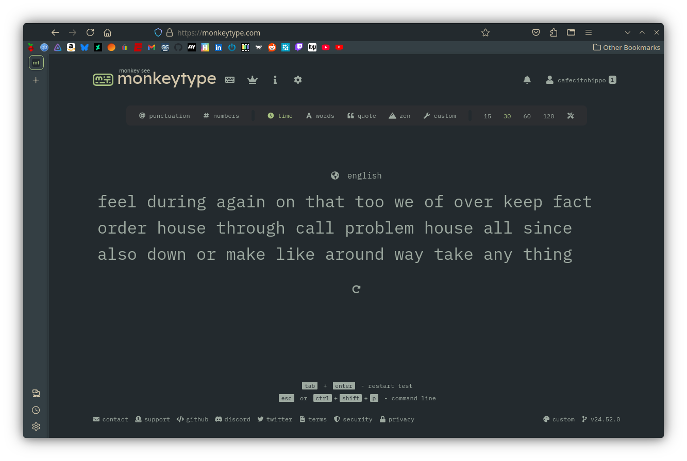

# dots-ish

## Dots type files for my desktop setup.

### Screenshots

#### Desktop

#### FastFetch

#### Discord
Adjusted color theme of [System24](https://github.com/refact0r/system24) theme by [refact0r](https://github.com/refact0r)

#### Spotify
Adjusted color theme of [text](https://github.com/spicetify/spicetify-themes/tree/master/text) theme by [darkthemer](https://github.com/darkthemer)

#### Kate
Changed the default Dracula theme to match the Everforest Dark Medium theme.

#### Monkeytype
This link will set the colorscheme of Monkeytpe to Everforest. Note, if you have a custom theme, it will overwrite your theme. [Everforest Dark Medium Theme](https://monkeytype.com?customTheme=eyJjIjpbIiMyMzJhMmUiLCIjYTdjMDgwIiwiIzgzYzA5MiIsIiM5ZGE5YTAiLCIjMmMyZTMxIiwiI2QzYzZhYSIsIiNlNjdlODAiLCIjNTQzYTQ4IiwiI2U2N2U4MCIsIiM1NDNhNDgiXX0=)

