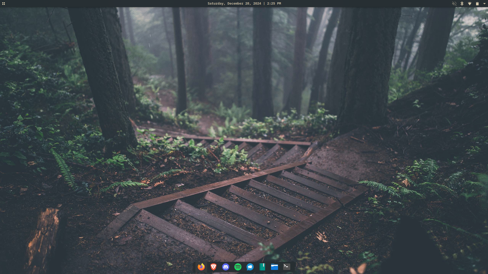
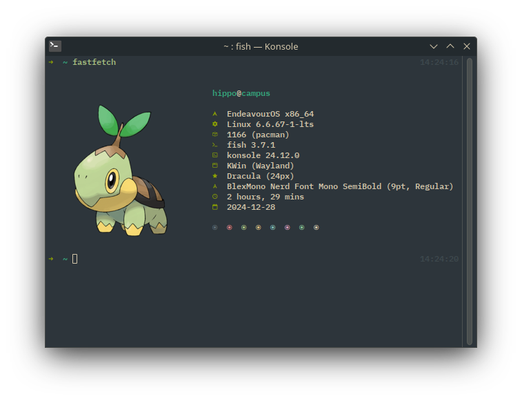
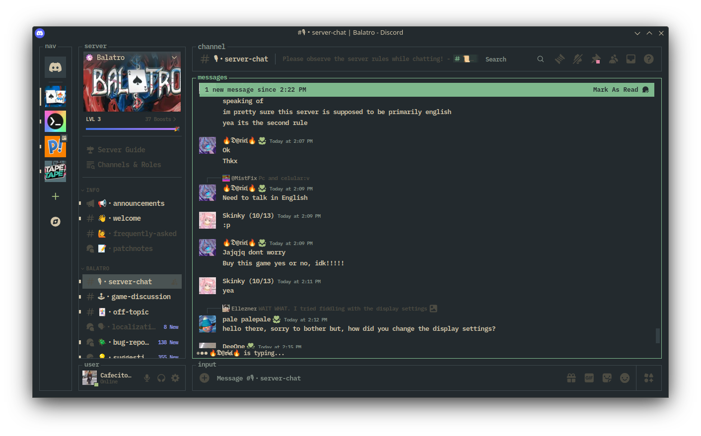
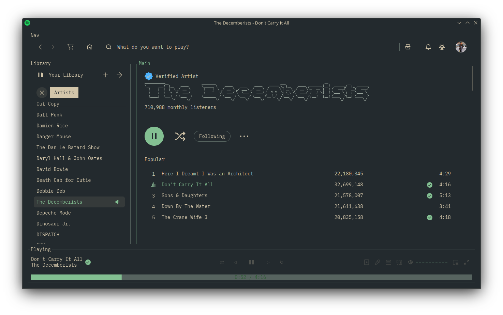
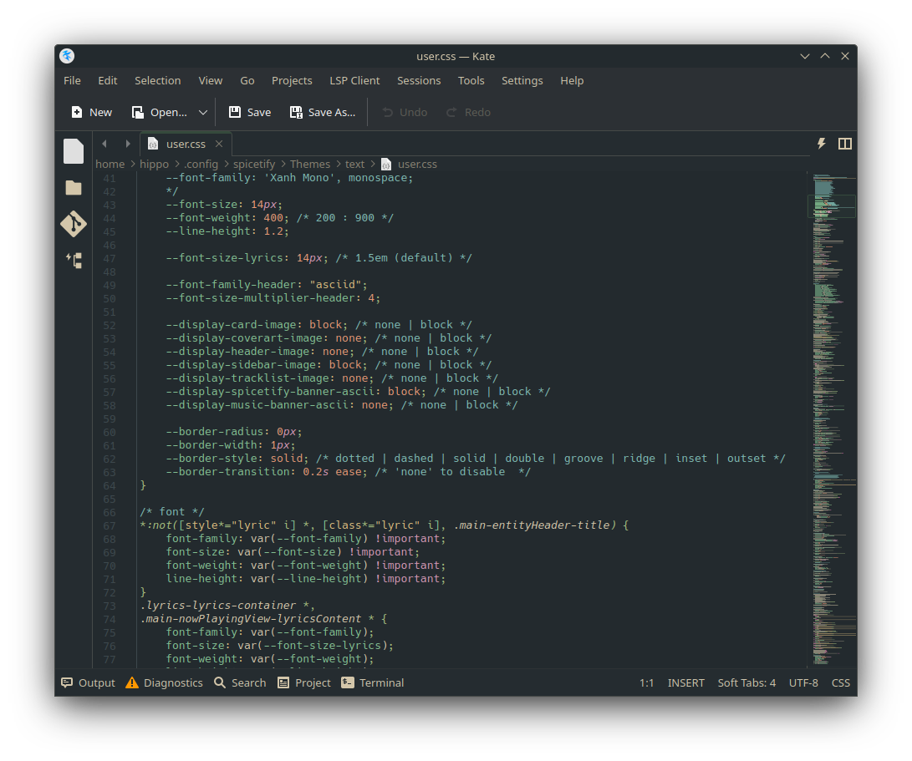
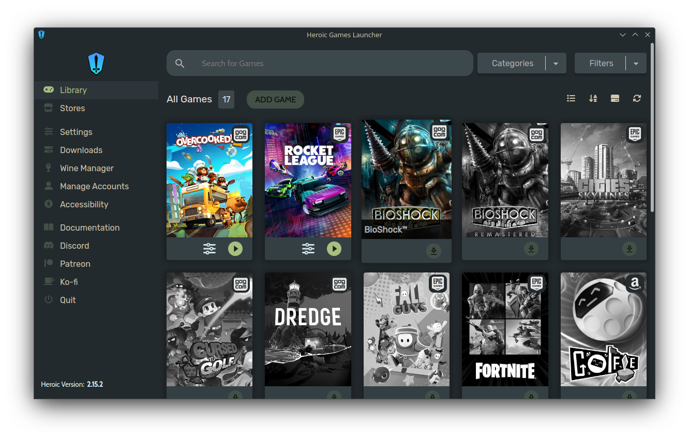

# dots-ish

## Dotfiles for my Everforest setup on KDE Plasma 6.

### Screenshots

#### Desktop
Plasma Color Theme: Install in Plasma Color settings.

#### FastFetch
Installation: Save the config.jsonc and turtwig.png to ~/.config/fastfetch. Prompt is [Tide](https://github.com/IlanCosman/tide) by [IlanCosman](https://github.com/IlanCosman)

#### Discord
Adjusted color theme of [System24](https://github.com/refact0r/system24) theme by [refact0r](https://github.com/refact0r). Installation: Install [Vencord](https://vencord.dev/) and save the .css file in ~/.config/Vencord/themes and enable in Vencord settings.

#### Spotify
Adjusted color theme of [text](https://github.com/spicetify/spicetify-themes/tree/master/text) theme by [darkthemer](https://github.com/darkthemer). Installation: Follow the installation instructions on the text. Overwrite the color.ini file in ~/.config/spicetify/themes/text. After overwriting the color.ini theme, run "spicetify apply" in terminal.

#### Kate
Changed the default Dracula theme to match the Everforest Dark Medium theme.

#### Heroic-Games Launcher
Adjusted the color theme of the Gruvbox Dark theme. Place the heroic-launcher folder in ~/.config/Heroic/themes and point Heroic to the custom .css file.

#### Monkeytype
This link will set the colorscheme of Monkeytpe to Everforest. Note, if you have a custom theme, it will overwrite your current theme. [Everforest Dark Medium Theme](https://monkeytype.com?customTheme=eyJjIjpbIiMyMzJhMmUiLCIjYTdjMDgwIiwiIzgzYzA5MiIsIiM5ZGE5YTAiLCIjMmMyZTMxIiwiI2QzYzZhYSIsIiNlNjdlODAiLCIjNTQzYTQ4IiwiI2U2N2U4MCIsIiM1NDNhNDgiXX0=)

